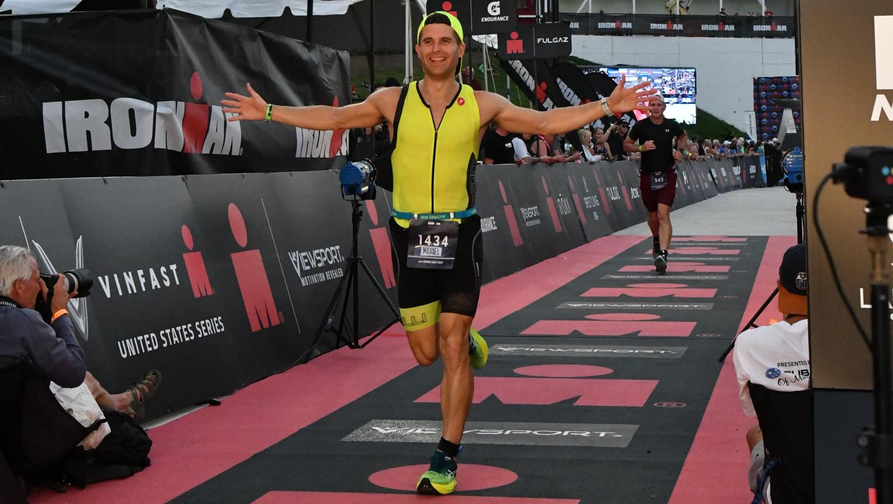

# 👋 Hi, I’m Michael

## 👨‍💻 About me

- 2x Ironman 🏊🚴‍♂️🏃‍♂️ Chattanooga '21 & Lake Placid '22
- Husband and Father of 2
- Writing code is relaxing
- 🤓 Lots of history with JavaScript
- 👀 Just finished a course on python and now working on a django project.
- 🌱 Also taking a c++ course - long term goal to write a native .fit generator for node.js
- I spent 4 years as an IT Director for a very large church - wonderful experience - found a second passion for the hands-on side of technology
- Other hobbies: the 🧙 Lord of the Rings novels, ancient languages - !עִבְרִית מַדְהִים 📜

## 🛠️Tech Stack
Most of these skills I am comfortable enough to just sit down and work - some of them I really love ❤️

  
  
  
  
  
  
  

 
 
  
  

  
  
  
  

 
  
  

 
  
  
  

  

 

 